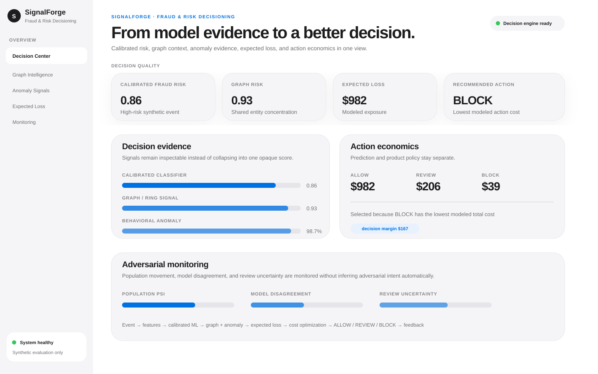

<div align="center">

# SignalForge

### Adversarial Fraud & Risk Decisioning with Calibrated ML, Graph Signals & Cost-Aware Actions

**An end-to-end machine learning decisioning platform for fraud, abuse, and operational risk—combining calibrated classification, expected-loss regression, anomaly detection, graph-risk signals, active learning, drift monitoring, SQL/Spark feature pipelines, and real-time `ALLOW / REVIEW / BLOCK` decisions.**

[](https://github.com/VinayK88/SignalForge/actions/workflows/ci.yml)
[](https://www.python.org/)
[](https://fastapi.tiangolo.com/)
[](https://scikit-learn.org/)
[](#batch--sql)
[](#evaluation--safety-boundary)

**Classification · Regression · Anomaly Detection · Graph ML · Calibration · Clustering · Active Learning · Drift Detection · Cost-Sensitive Decisioning · SQL · Spark · FastAPI**

[Dashboard](#dashboard-preview) · [Architecture](#system-architecture) · [ML Stack](#machine-learning-stack) · [Examples](#decision-examples) · [Monitoring](#adversarial-monitoring) · [API](#api) · [Quick Start](#quick-start)

</div>

---

## Dashboard preview

<p align="center">
  
</p>

<p align="center"><sub><b>Static synthetic preview.</b> No customer, payment, device, fulfillment, retailer, or production telemetry is included.</sub></p>

The dashboard is designed around the actual decision lifecycle rather than a single model score:

| View | What it answers |
| --- | --- |
| **Calibrated fraud risk** | How likely is the event to be fraudulent or abusive? |
| **Graph / ring risk** | Is the account connected to unusual device, payment, or shipping reuse? |
| **Behavioral anomaly** | How unusual is the event relative to the synthetic legitimate reference population? |
| **Expected loss** | What financial exposure is modeled if the event is allowed? |
| **Decision economics** | Which action has the lowest modeled total cost? |
| **Adversarial monitoring** | Are the population, review queue, or behavioral patterns changing? |

---

## Why SignalForge

Traditional fraud projects often stop at `P(fraud)`. SignalForge separates **prediction**, **financial exposure**, and **business action** into distinct, auditable layers.

```text
                       SIGNALFORGE
                            │
                  Event / transaction
                            │
                            ▼
                    Feature contract
                            │
           ┌────────────────┼────────────────┐
           │                │                │
           ▼                ▼                ▼
   Calibrated fraud     Graph-risk       Isolation Forest
      classifier           model         anomaly detection
           │                │                │
           └────────────────┼────────────────┘
                            ▼
                     Hybrid risk view
                            │
                            ▼
                Expected-loss regression
                            │
                            ▼
                  Cost-sensitive policy
                            │
              ┌─────────────┼─────────────┐
              ▼             ▼             ▼
            ALLOW         REVIEW         BLOCK
              │             │             │
              └─────────────┼─────────────┘
                            ▼
                 Analyst / outcome feedback
                            │
                            ▼
          Active learning + drift + cohorts
```

The core design question is not simply **“Is this fraud?”** It is:

> **Given calibrated risk, expected loss, graph context, anomaly evidence, customer friction, and review cost—what is the best decision?**

---

## System architecture

```text
┌──────────────────────────────────────────────────────────────────────┐
│                         EVENT SOURCES                                │
│ Account · Device · Payment · Order · Fulfillment · Refund behavior │
└──────────────────────────────┬───────────────────────────────────────┘
                               │
                    ┌──────────▼──────────┐
                    │  Feature Contract   │
                    │ online + batch parity│
                    └──────────┬──────────┘
                               │
            ┌──────────────────┼───────────────────┐
            │                  │                   │
            ▼                  ▼                   ▼
      Fraud Classifier    Graph-Risk Model   Behavioral Anomaly
      + Calibration       Shared Entities     Isolation Forest
            │                  │                   │
            └──────────────────┼───────────────────┘
                               ▼
                     Expected-Loss Model
                               │
                               ▼
                     Decision Optimizer
                 ALLOW / REVIEW / BLOCK
                               │
              ┌────────────────┴────────────────┐
              ▼                                 ▼
      Real-time FastAPI                 Batch SQL / PySpark
              │                                 │
              └────────────────┬────────────────┘
                               ▼
           Monitoring · Active Learning · DBSCAN Cohorts
```

### Real-time + batch parity

SignalForge uses the same named feature contract across the API and batch examples so that online and offline scoring do not silently diverge.

```text
FastAPI event ───────┐
                     ├── Feature contract ── ML decision engine
SQL / PySpark batch ─┘
```

---

## Machine learning stack

| Layer | Technique | Primary role | Evaluation / guardrail |
| --- | --- | --- | --- |
| **Fraud classifier** | Gradient Boosting + sigmoid calibration | Calibrated fraud probability | ROC-AUC, PR-AUC, Brier score |
| **Expected loss** | Gradient Boosting Regressor | Estimate synthetic financial exposure | MAE, R² |
| **Behavior anomaly** | Isolation Forest | Novel / low-frequency behavior | Reference-population percentile |
| **Graph risk** | Logistic Regression over graph-derived features | Shared-entity / ring structure | Holdout ROC-AUC |
| **Cohort discovery** | DBSCAN | Emerging behavioral cohorts | Descriptive only; no actor attribution |
| **Active learning** | Uncertainty + model disagreement | Prioritize analyst review labels | Advisory ranking |
| **Drift monitoring** | Population Stability Index (PSI) | Detect feature-distribution movement | Does not infer adversarial intent |
| **Decision engine** | Expected-cost optimization | Convert evidence into action | Transparent action-cost vector |

### Graph signals

The graph layer deliberately uses interpretable shared-entity features rather than claiming a production GNN:

```text
Account ───── Device
   │            │
   ├──────── Payment
   │            │
   └──────── Shipping Address
```

Representative graph features include:

- accounts per device over a recent window;
- accounts sharing a payment instrument;
- accounts sharing a shipping destination;
- connected component size;
- risky-neighbor ratio.

---

## Cost-sensitive decisioning

A model score is evidence; it is **not** the final policy decision.

```text
Expected action cost =
    residual fraud loss
  + false-positive customer friction
  + manual-review cost
  + fulfillment intervention cost
```

For every event, SignalForge computes a transparent cost vector:

```json
{
  "action_costs": {
    "ALLOW":  "<modeled cost>",
    "REVIEW": "<modeled cost>",
    "BLOCK":  "<modeled cost>"
  },
  "decision": "<minimum-cost action>",
  "decision_margin": "<distance to next-best action>"
}
```

This makes it possible to change business-policy assumptions without retraining the predictive models.

---

# Decision examples

The examples below use **synthetic, illustrative values** to make the decision flow easy to understand. Runtime values are produced by the checked-in deterministic synthetic models and may differ from these examples.

## Example 1 — High-risk shared-entity pattern

### Request

```http
POST /score
Content-Type: application/json
```

```json
{
  "event_id": "ord-high-risk-1042",
  "account_age_days": 2,
  "order_amount": 1249.0,
  "device_accounts_7d": 6,
  "payment_accounts_30d": 4,
  "shipping_accounts_30d": 8,
  "velocity_1h": 5,
  "refund_rate_30d": 0.38,
  "distance_from_home_km": 1710,
  "new_device": true,
  "digital_goods": false,
  "graph_component_size": 21,
  "risky_neighbor_ratio": 0.46
}
```

### Representative response

```json
{
  "event_id": "ord-high-risk-1042",
  "fraud_probability": 0.86,
  "graph_risk": 0.93,
  "anomaly_percentile": 98.7,
  "combined_risk": 0.88,
  "expected_loss": 982.0,
  "decision": "BLOCK",
  "action_costs": {
    "ALLOW": 982.0,
    "REVIEW": 205.76,
    "BLOCK": 39.02
  },
  "decision_margin": 166.74,
  "reason_codes": [
    "new_account",
    "high_device_reuse",
    "shared_payment_pattern",
    "high_shipping_reuse",
    "high_velocity",
    "elevated_graph_risk"
  ],
  "model_version": "0.1.0",
  "feature_schema_version": "2026-08-18"
}
```

**Interpretation:** several weak signals become materially stronger when combined: a new account, shared infrastructure, high velocity, elevated graph risk, and meaningful expected exposure.

---

## Example 2 — Ambiguous event routed to review

```json
{
  "event_id": "ord-review-2207",
  "account_age_days": 17,
  "order_amount": 340.0,
  "device_accounts_7d": 3,
  "payment_accounts_30d": 2,
  "shipping_accounts_30d": 3,
  "velocity_1h": 2,
  "refund_rate_30d": 0.16,
  "distance_from_home_km": 420,
  "new_device": true,
  "digital_goods": false,
  "graph_component_size": 9,
  "risky_neighbor_ratio": 0.19
}
```

Representative decision evidence:

```json
{
  "fraud_probability": 0.43,
  "graph_risk": 0.31,
  "anomaly_percentile": 77.0,
  "combined_risk": 0.40,
  "expected_loss": 80.0,
  "decision": "REVIEW",
  "action_costs": {
    "ALLOW": 80.0,
    "REVIEW": 26.8,
    "BLOCK": 30.2
  },
  "review_priority": "HIGH"
}
```

**Interpretation:** the event is not strong enough for an aggressive action, but uncertainty plus modeled exposure makes analyst review cheaper than either allowing or blocking it outright.

---

## Example 3 — Low-risk event allowed

```json
{
  "event_id": "ord-low-risk-0311",
  "account_age_days": 164,
  "order_amount": 62.0,
  "device_accounts_7d": 1,
  "payment_accounts_30d": 1,
  "shipping_accounts_30d": 1,
  "velocity_1h": 1,
  "refund_rate_30d": 0.02,
  "distance_from_home_km": 18,
  "new_device": false,
  "digital_goods": false,
  "graph_component_size": 4,
  "risky_neighbor_ratio": 0.03
}
```

Representative outcome:

```json
{
  "fraud_probability": 0.07,
  "graph_risk": 0.04,
  "anomaly_percentile": 12.0,
  "combined_risk": 0.09,
  "expected_loss": 8.0,
  "decision": "ALLOW",
  "reason_codes": ["established_account", "low_entity_reuse"]
}
```

---

## Example 4 — Emerging adversarial pattern

SignalForge also includes a deliberately shifted synthetic population to exercise monitoring behavior.

```text
Reference population
        │
        ▼
Feature distributions
        │
        ├── account age
        ├── device sharing
        ├── payment sharing
        ├── shipping reuse
        ├── refund behavior
        └── velocity
        │
        ▼
       PSI
        │
        ▼
Population movement detected
        │
        ├── DBSCAN cohort discovery
        └── analyst investigation
```

Example monitoring summary:

```json
{
  "status": "DRIFT_REVIEW",
  "signals": [
    "younger_account_population",
    "increased_device_sharing",
    "increased_shipping_reuse",
    "higher_refund_behavior"
  ],
  "interpretation": "population movement detected; adversarial intent not inferred automatically"
}
```

---

## Adversarial monitoring

SignalForge deliberately separates several concepts that are often conflated:

```text
population drift ≠ concept drift ≠ adversarial adaptation
```

The monitoring layer includes:

- PSI for account age, velocity, device/payment/shipping sharing, and refund behavior;
- supervised vs anomaly vs graph-signal disagreement;
- DBSCAN cohort discovery;
- active-learning queue concentration;
- model-version and feature-schema metadata.

**PSI alone does not prove fraud evolution.** A production investigation would combine population movement with outcomes, calibration changes, analyst feedback, and business context.

---

## Active learning

The most useful analyst labels are not always the highest-risk events. SignalForge prioritizes cases where model evidence is uncertain or contradictory.

```text
Fraud classifier ──┐
Graph-risk model ──┼── disagreement / uncertainty ──► Review priority
Anomaly detector ──┘
```

Examples of high-value review candidates:

- calibrated fraud probability near the decision boundary;
- high anomaly percentile but low supervised score;
- elevated graph risk with otherwise normal transaction features;
- material expected loss combined with uncertain classification.

---

## Batch & SQL

The repository demonstrates both real-time and large-scale batch patterns:

| Path | Purpose |
| --- | --- |
| `sql/features.sql` | Relational account/device/payment/shipping feature engineering |
| `spark/batch_scoring.py` | PySpark-compatible batch feature pipeline |
| `signalforge/features.py` | Shared feature contract used by model scoring |
| `signalforge/api.py` | Real-time FastAPI interface |

The goal is **online/offline feature parity**, not a notebook-only fraud model.

---

## API

```text
GET  /healthz     service health
POST /score       score one event and return decision evidence
GET  /report      synthetic evaluation + drift + cohort report
GET  /docs        interactive FastAPI documentation
```

### cURL

```bash
curl -X POST http://localhost:8000/score \
  -H 'Content-Type: application/json' \
  -d '{
    "event_id": "ord-demo-1042",
    "account_age_days": 2,
    "order_amount": 1249,
    "device_accounts_7d": 6,
    "payment_accounts_30d": 4,
    "shipping_accounts_30d": 8,
    "velocity_1h": 5,
    "refund_rate_30d": 0.38,
    "distance_from_home_km": 1710,
    "new_device": true,
    "digital_goods": false,
    "graph_component_size": 21,
    "risky_neighbor_ratio": 0.46
  }'
```

---

## Business-facing outputs

SignalForge is built to answer questions beyond model accuracy:

| Business question | System output |
| --- | --- |
| How risky is this event? | Calibrated fraud probability + hybrid risk |
| What makes it unusual? | Anomaly percentile + reason codes |
| Is this part of coordinated behavior? | Shared-entity graph risk |
| What could we lose? | Expected-loss regression |
| What should we do? | Cost-aware ALLOW / REVIEW / BLOCK |
| What should an analyst label next? | Active-learning priority |
| Is behavior changing? | PSI + cohort monitoring |

---

## Production ML practices demonstrated

- calibrated probabilities rather than raw classifier scores;
- explicit separation of **model score** and **decision policy**;
- interpretable graph features and reason codes;
- expected-loss modeling for business impact;
- online/offline feature-contract parity;
- batch + real-time scoring patterns;
- active learning for human feedback;
- drift monitoring without overclaiming adversarial intent;
- model and feature-schema versioning;
- CI across Python 3.10, 3.11, and 3.12;
- synthetic-only reproducible public data.

---

## Evaluation & safety boundary

Everything in this repository is **synthetic and defensive**.

SignalForge does **not** claim:

- Apple, retailer, bank, payment-network, or customer production data;
- real prevented-loss metrics;
- real fraud capture / false-positive rates;
- production-ready policy thresholds;
- actor attribution from clustering or graph risk;
- adversarial intent from PSI alone.

Synthetic loss values, sample decisions, dashboard values, and decision costs exist to exercise the engineering and decision-science architecture.

---

## Quick Start

```bash
git clone https://github.com/VinayK88/SignalForge.git
cd SignalForge

python -m venv .venv
source .venv/bin/activate
pip install -e '.[api]'

# Synthetic evaluation + monitoring report
signalforge

# Tests
python -m unittest discover -s tests -v

# Real-time API
uvicorn signalforge.api:app --reload
```

### Docker

```bash
docker build -t signalforge .
docker run --rm -p 8000:8000 signalforge
```

Open:

```text
http://localhost:8000/docs
```

---

## Repository map

```text
SignalForge/
│
├── signalforge/
│   ├── synthetic.py      deterministic synthetic populations
│   ├── features.py       online/offline feature contract + reason codes
│   ├── graph.py          shared-entity graph construction / summary
│   ├── models.py         classification, calibration, regression, anomaly,
│   │                     graph risk and DBSCAN cohort discovery
│   ├── decision.py       cost-sensitive ALLOW / REVIEW / BLOCK policy
│   ├── monitoring.py     PSI + active-learning diagnostics
│   ├── service.py        end-to-end scoring / evaluation report
│   └── api.py            FastAPI service
│
├── sql/                  relational feature-engineering examples
├── spark/                PySpark-compatible batch example
├── tests/                ML quality + decision + drift + API tests
├── assets/               dashboard preview
├── docs/                 model / evaluation methodology
├── Dockerfile
└── .github/workflows/    CI
```

---

<div align="center">

### **Predict risk. Quantify loss. Optimize the decision. Monitor the adversary.**

<sub>Built as a reproducible synthetic reference architecture for production-oriented fraud and risk ML.</sub>

</div>
